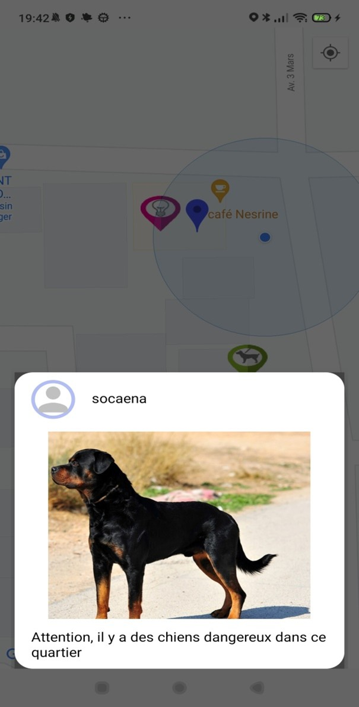
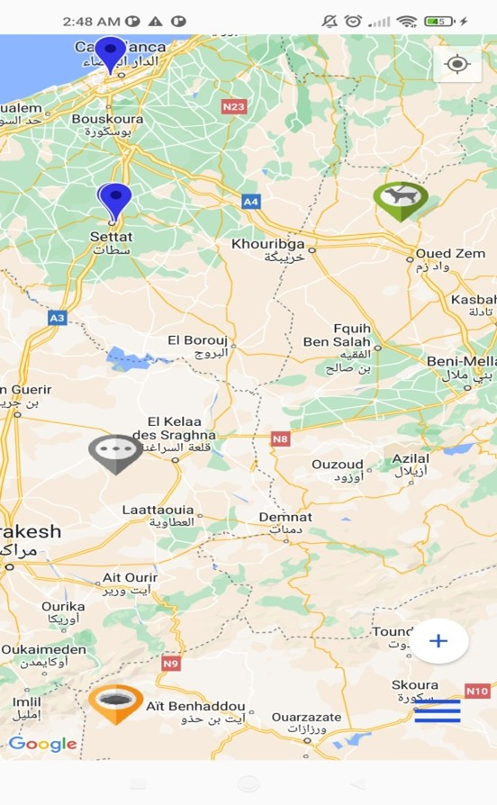
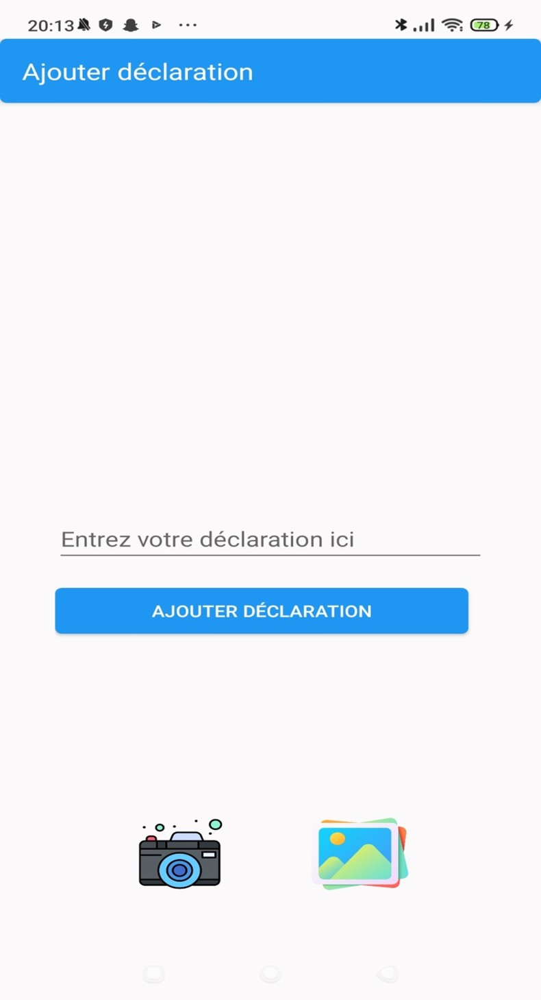
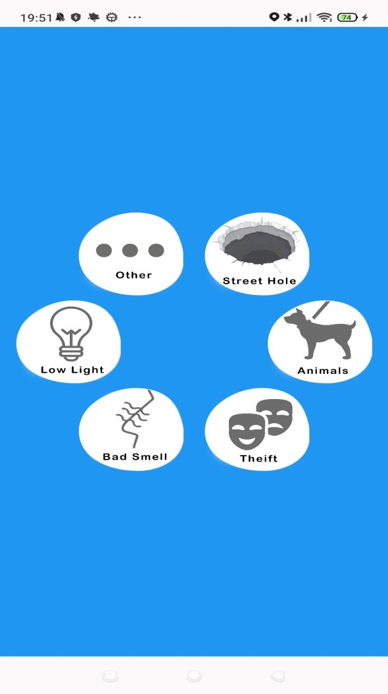
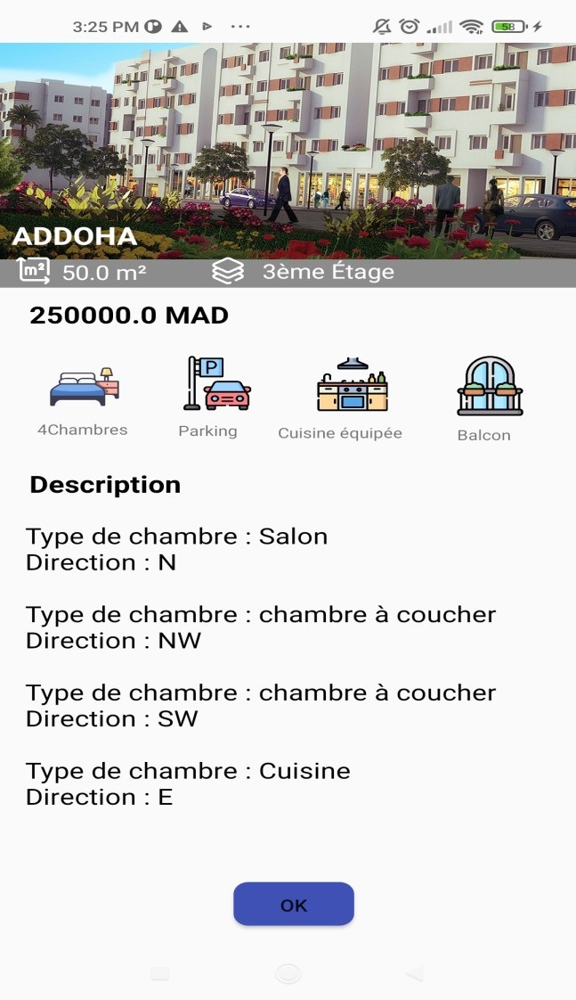
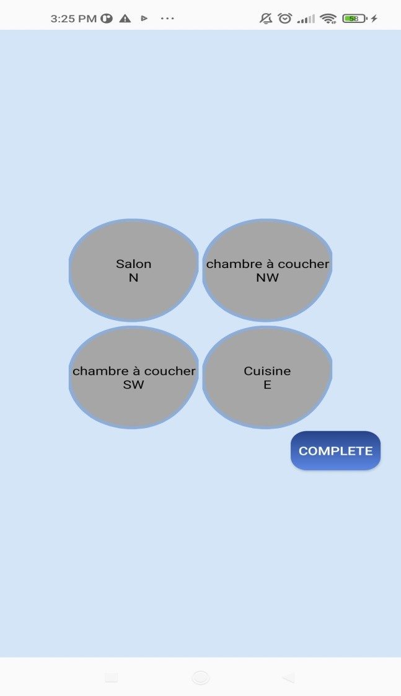
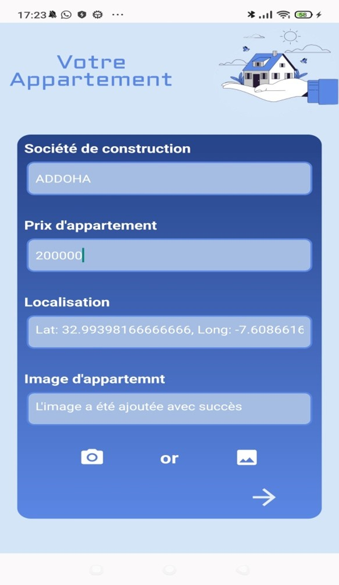
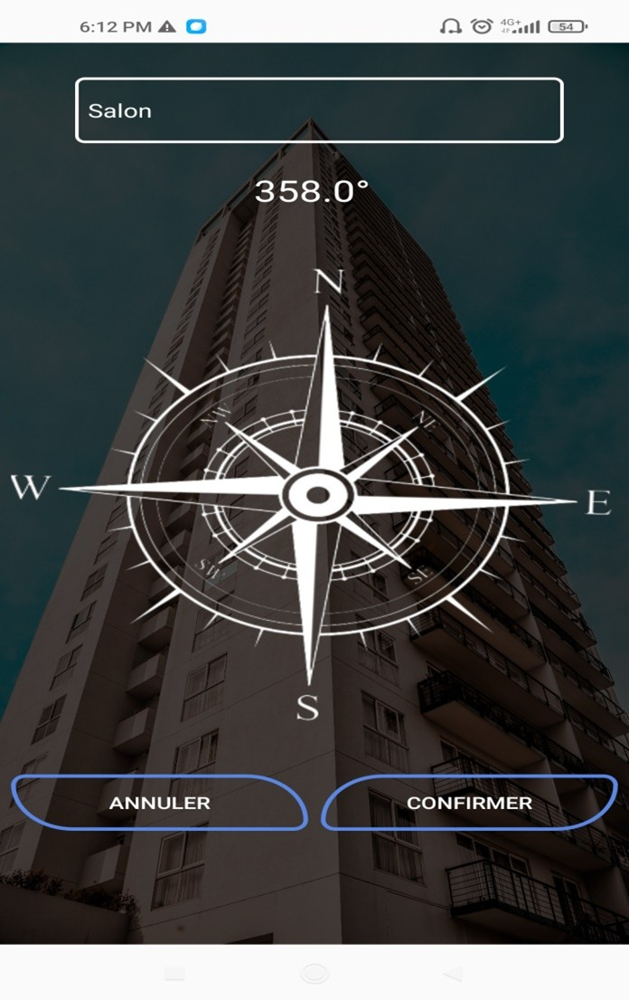
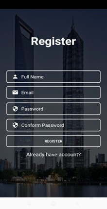

<div align="center">

# 📱 Android Mobile Decision Support App

**A real-world Android application developed during an internship at Al Omrane**  
*Report · Visualize · Analyze urban and environmental issues*

[](https://developer.android.com)
[](https://www.java.com)
[](https://firebase.google.com)
[](https://developers.google.com/maps)
[](https://openai.com)

</div>

---

## 📌 Overview

This Android application was developed during an internship as a **Mobile Developer Intern at Al Omrane**. It empowers users to **report, visualize, and analyze urban and environmental issues** — such as dangerous animals, theft, poor street lighting, and infrastructure damage — while providing **intelligent decision support** through maps, sensors, and AI-powered services.

---

## 🎯 Objectives

- Build a production-grade Android application addressing real urban challenges
- Enable citizens to report environmental and infrastructure issues with ease
- Provide location-aware decision support through interactive maps
- Integrate industry-standard APIs (Google Maps, Firebase, OpenAI)
- Deliver a polished, intuitive user experience

---

## ✨ Features

| Feature | Description |
|---|---|
| 🗺️ **Interactive Map** | Real-time markers, location tracking, and map overview |
| ⚠️ **Issue Reporting** | Report animals, theft, street holes, bad smells, poor lighting, and more |
| 📝 **Declarations** | Add detailed reports with text descriptions and photo attachments |
| 🧭 **Compass Orientation** | Sensor-based compass for apartment direction alignment |
| 🏠 **Apartment Configuration** | Define rooms, directions, and spatial layout |
| 📊 **Property Visualization** | Detailed property information and data display |
| 🔐 **Authentication** | Secure Login and Register flows |
| 🔥 **Firebase Backend** | Real-time database, authentication, and cloud storage |
| 🤖 **AI Integration** | OpenAI API for intelligent recommendations and analysis |

---

## 🛠️ Tech Stack

| Layer | Technology |
|---|---|
| **Language** | Java |
| **IDE** | Android Studio |
| **Backend** | Firebase (Firestore, Auth, Storage) |
| **Mapping** | Google Maps API |
| **AI** | OpenAI API |
| **SDK** | Android SDK |

---

## 📸 Screenshots

<table>
  <tr>
    <td align="center"><strong>🗺️ Map View</strong><br/></td>
    <td align="center"><strong>🌍 Map Overview</strong><br/></td>
    <td align="center"><strong>⚠️ Danger Detection</strong><br/></td>
  </tr>
  <tr>
    <td align="center"><strong>📝 Add Declaration</strong><br/></td>
    <td align="center"><strong>📊 Categories</strong><br/></td>
    <td align="center"><strong>📋 Property Details</strong><br/></td>
  </tr>
  <tr>
    <td align="center"><strong>🏠 Room Selection</strong><br/></td>
    <td align="center"><strong>🏢 Apartment Form</strong><br/></td>
    <td align="center"><strong>🧭 Compass</strong><br/></td>
  </tr>
  <tr>
    <td align="center"><strong>🔐 Register</strong><br/></td>
    <td align="center"><strong>🔑 Login</strong><br/></td>
    <td></td>
  </tr>
</table>

---

## 📂 Project Structure

```
android-mobile-decision-support-app/
│
├── app/
│   ├── src/                    # Application source code
│   ├── libs/                   # Local libraries
│   └── build.gradle            # App-level Gradle config
│
├── gradle/                     # Gradle wrapper files
├── assets/                     # Screenshot assets for README
│
├── .gitignore
├── build.gradle                # Project-level Gradle config
├── gradle.properties
├── gradlew
├── gradlew.bat
├── settings.gradle
└── README.md
```

---

## ⚙️ Installation & Setup

### Prerequisites

- Android Studio (latest stable release)
- Android SDK (API level 24+)
- A physical device or emulator running Android 7.0+

### Steps

**1. Clone the repository**

```bash
git clone https://github.com/Souadzriouil/android-mobile-decision-support-app.git
cd android-mobile-decision-support-app
```

**2. Open in Android Studio**

Go to `File > Open` and select the cloned project folder.

**3. Sync Gradle**

Click **Sync Now** when prompted, or go to `File > Sync Project with Gradle Files`.

**4. Configure API Keys**

Create and configure the following:

- **Google Maps API** — Add your key to `AndroidManifest.xml`:
  ```xml
  <meta-data
      android:name="com.google.android.geo.API_KEY"
      android:value="YOUR_GOOGLE_MAPS_API_KEY"/>
  ```

- **Firebase** — Download `google-services.json` from the [Firebase Console](https://console.firebase.google.com) and place it in the `app/` directory.

- **OpenAI API** — Add your key to the appropriate constants file in the source code.

**5. Run the App**

Select your target (emulator or physical device) and click ▶️ **Run**.

---

## 📸 Adding Screenshots

To display screenshots properly in this README:

```bash
# 1. Create the assets folder at the project root
mkdir assets

# 2. Add your screenshots with these exact filenames:
#    map-view.png         report-danger.png     add-declaration.png
#    categories.png       room-selection.png    property-details.png
#    compass.png          form.png              map-overview.png
#    register.png         login.png

# 3. Commit and push
git add .
git commit -m "Add screenshots and update README"
git push
```

---

## 👩‍💻 My Role

During this internship, I:

- Designed and developed all Android application features end-to-end
- Integrated **Google Maps API** for real-time location services and interactive maps
- Implemented **Firebase** for authentication, cloud storage, and real-time data
- Integrated **OpenAI API** to power intelligent decision-support features
- Designed user-friendly UI/UX interfaces aligned with modern Android standards
- Performed testing, debugging, and performance optimization throughout the project

---

## 📈 Learning Outcomes

- Android development lifecycle and architecture patterns
- Mobile UI/UX design for real-world use cases
- API integration: Maps, Firebase, and AI
- Debugging, testing, and optimizing Android applications
- Problem-solving in a professional internship environment

---

## 🔐 Security Notice

> ⚠️ **API keys and sensitive configuration files are not included in this repository.**  
> You must supply your own credentials (`google-services.json`, Maps API key, OpenAI key) to build and run the app locally.

---

## 📬 Contact

<div align="center">

**Souad Zriouil**  
📍 Settat, Morocco  
📧 [souadzriouil02@gmail.com](mailto:souadzriouil02@gmail.com)  
🔗 [GitHub Profile](https://github.com/Souadzriouil)

</div>

---

<div align="center">

⭐ **If you found this project helpful, please consider starring the repository!**  
It helps others discover it and motivates further development.

</div>
